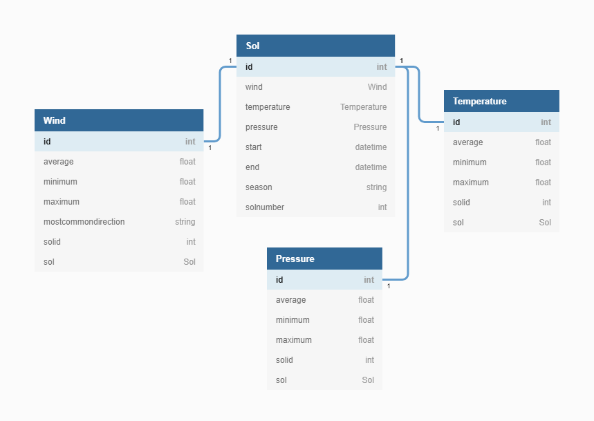

# Mars Weather

Tiimi: Heta Björklund, Joni Jaakkola, Christian Lindell, Dmitry Sinyavskiy ja Irina Tregub.

## Johdanto

Mars Weather on sääsovellus, joka näyttää Marsin sään. Käyttäjä voi katsoa tämänhetkistä säätä, viimeisen viikon säätä, tai hakea säätiedot tietyltä päivältä. Sovellus hakee säätiedot NASAn avoimesta ["InSight: Mars Weather Service API"-rajapinnasta](api.nasa.gov/insight_weather). Lisää tietoa InSight-missiosta löytyy [täältä](https://mars.nasa.gov/insight/weather/) ja NASAn rajapinta on dokumentoitu [täällä](https://api.nasa.gov/assets/insight/InSight%20Weather%20API%20Documentation.pdf).

## Järjestelmän määrittely

Alla kuvattuna järjestelmän tarpeet tarkemmin käyttäjätarinoiden kautta.

### Käyttäjätarinat

KT1 Tähtitieteen harrastajana haluan nähdä, millainen sää Marsissa on nyt, jotta voin verrata säätilaa kaukoputkella tekemiini näköhavaintoihin. 

KT2 Maantieteen opettajana haluan helppokäyttöisen työkalun, jolla selittää ja opettaa oppilaille sään ja ilmaston toimintaa. 

KT3 Tähtitieteen opiskelijana haluan yhdestä palvelusta helposti minua kiinnostavia avaruussään tietoja, pysyäkseni tietoisena ”paikallisista” astronomian tapahtumista. 

KT4 Viikonlopputieteilijänä haluan keskitetysti tietoa maan, paikallisen avaruussään ja Marsin säästä, jotta voisin tutkiskella korrelaatiota näiden välillä. 

KT5 Teknisesti taitamattomana tiedeharrastajana haluaisin selkeästi yhdestä paikasta kaikki Nasan API-tiedot selkeästi esiteltynä harrastuksiani varten. 

KT6 Roolipelikampanjan vetäjänä haluaisin pelikampanjani materiaaliksi esityksiä ja karttoja aurinkokunnan säästä ja kiertävistä asteroideista helposti yhdestä paikasta. 

KT7 Tähtitieteen harrastajana haluan nähdä, millainen sää Marsissa on ollut viimeisen viikon aikana, jotta voin verrata säätilaa aikaisempiin kaukoputkella tekemiini näköhavaintoihin. 

KT8 Tulevana avaruusmatkailijana haluan saada lämpötilatiedot eri lämpötilayksiköissä (Fahrenheit/Celsius), mutta en halua, että molemmat näkyisivät samalla, jotta ei tulisi sekaannuksia.  

KT9 Tähtitieteen opiskelijana haluan saada mahdollisia tilastotietoja (esim. Päivän/viikon/vuoden matalin ja korkein lämpötila, tuulen keskinopeus).

KT10 Avaruusmatkailijana haluaisin tietää tulevaa säätä, mutta jos sovellus ei tee sääennustuksia, minua auttaisi, jos olisi mahdollista saada tiedot valitulle päivälle, esimerkiksi sää X päivänä vuosi sitten.

## Luokkakaavio

## Tekninen toteutus

### Back end

Back end on toteutettu [ASP.NET Coren web-sovelluksena](https://docs.microsoft.com/en-us/aspnet/core/tutorials/first-web-api?view=aspnetcore-6.0&tabs=visual-studio-code).

Back endin GitHub-repositorio löytyy osoitteesta https://github.com/Mars-Weather/marsweatherapi

Syy siihen, että front end ei hae dataa suoraan Nasan rajapinnasta, vaan data kierrätetään oman back endin ja tietokannan kautta, on se, että vanhaa dataa voidaan tallentaa, näyttää historiatietoja (eikä ainoastaan viimeisintä 7 solia, jonka Nasan rajapinta palauttaa) ja luoda tilastoja sään vaihtelusta.

Koska NASAn rajapinnasta ei aina saa luotettavaa dataa [Marsin sääolosuhteiden takia](https://mars.nasa.gov/news/8858/insight-is-meeting-the-challenge-of-winter-on-dusty-mars/?site=insight), sovellus käyttää myös generoitua dataa, joka on saman muotoista kuin oikea, NASAn rajapinnasta saatava data, mutta joka ei perustu oikeisiin mittauksiin.

[DbUpdateService](./Services/DbUpdateService.cs)-luokka on ajoitettu taustapalvelu, joka säännöllisin väliajoin tarkistaa, ovatko generoidun datan sisältämät Solit jo tietokannassa ja jos eivät ole, se lisää generoidun datan tietokantaan. Huomaa, että palvelu tarkistaa isoimman tietokannasta löytyvän Solnumberin ja vertaa sitä generoidun datan Solnumbereihin. Se olettaa, että Solien numerot kasvavat ajan kuluessa eteenpäin, joten jos tietokantaan luodaan manuaalisesti tai Postmanilla Sol, jonka Solnumber on suurempi kuin generoidun datan isoin Solnumber, palvelu olettaa että myös kaikki sitä pienemmät Solnumberit ovat jo tietokannassa, eikä lisää generoitua dataa.

Projektissa on neljä haaraa: master, localdb, localdb-testing ja remotedb.

#### Master
- master-haara on kehityshaara.
- Tietokanta on InMemory-tietokanta. Tietokanta ei ole persistentti, vaan tiedot häviävät kun sovellus sammutetaan.
- Endpointit ovat muotoa localhost:[portti]/api/sol

#### Localdb
- localdb-haara on kehityshaara.
- Tietokanta on Microsoft SQL Server. Tietokanta on persistentti, mutta sinne pääsee käsiksi vain paikallisesti.
- Endpointit ovat muotoa localhost:[portti]/api/sol

#### Localdb-testing
- localdb-testing on testaushaara. Sen sisältö on testejä lukuunottamatta muuten identtinen localdb-haaran kanssa, mutta kansiorakenne on erilainen, koska testaus .NETin testaustyökalulla ja xUnitilla vaatii, että lähdekoodi ja testauskoodi ovat erillisissä kansioissa.
- Tietokanta on Microsoft SQL Server. Tietokanta on persistentti, mutta sinne pääsee käsiksi vain paikallisesti.
- Endpointit ovat muotoa localhost:[portti]/api/sol

#### Remotedb
- remotedb-haara on projektin tuotantohaara ja julkaistu versio.
- Tietokanta on MySQL. Tietokanta on persistentti ja sitä voi hallinnoida ja muokata Azuren dashboardin kautta (ei julkinen, vain tiimin jäsenten saatavilla).
- Tietokantaa voi tarkastella myös lähettämällä GET-pyyntöjä Postmanilla. Avoin pyyntökokoelma löytyy osoitteesta https://www.postman.com/hetabjorklund/workspace/mars-weather-public/
- Julkaistun sovelluksen osoite on https://marsweather.azurewebsites.net/
- Endpointit ovat muotoa https://marsweather.azurewebsites.net/api/sol

### Front end

Front end on toteutettu React Appina. 

Front endin GitHub-repositorio löytyy osoitteesta https://github.com/Mars-Weather/marsweatherui

Julkaistun front endin osoite on https://weather-mars.herokuapp.com/

## Testaus

Tulossa.

